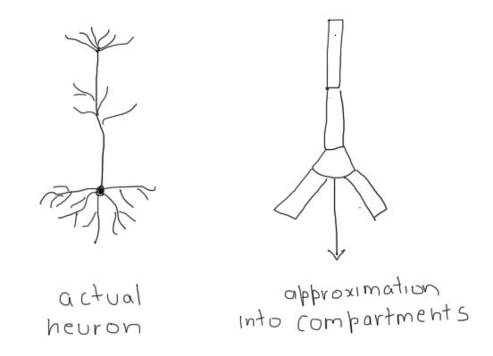
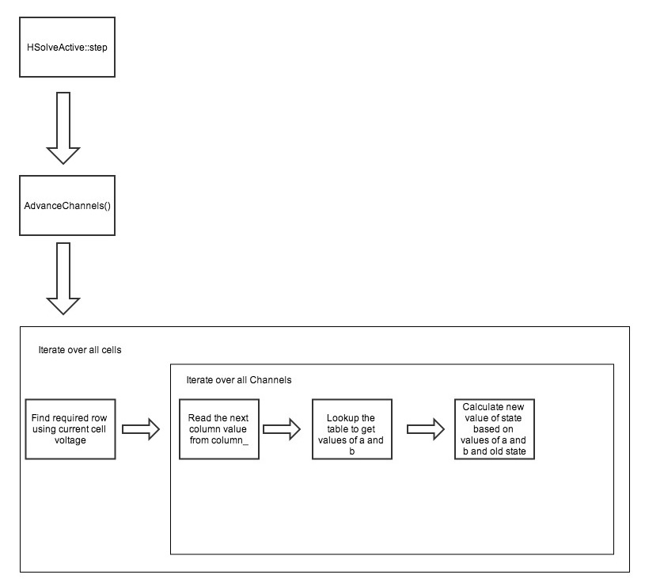
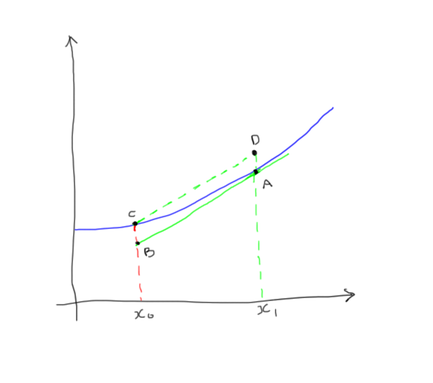
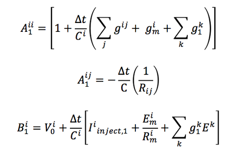
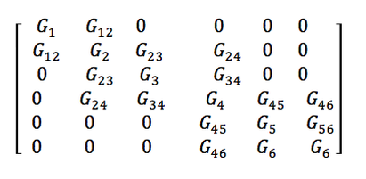
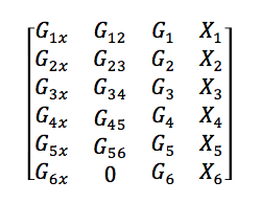
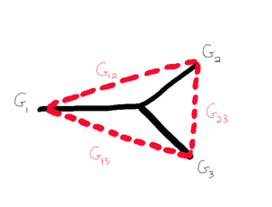

__This work was done by Vivek Sagar (This is taken from [his blog](https://vivekvidyasagaran.weebly.com/moose))__

# MOOSE- An Overview 

*MOOSE* is the Multiscale Object-Oriented Simulation Environment. It is
the base and numerical core for large, detailed simulations including
Computational Neuroscience and Systems Biology."  
This is the definition of MOOSE given by its creators. It basically
provides a framework using which biological systems can be easily
modelled and simulated, with comparatively less work from the programmer
(than starting the programming from scratch).  
  
The project is hosted at github [here](http://github.com/BhallaLab/moose)
  
A lot of the information on this page (most of it in fact) is derived from the
work of James M Bower and David Beeman in _The Book of Genesis_. Here, I have
merely picked the parts of the book that are most relevant to my work and
presented it. In order to gain an in depth understanding of this field, I would
suggest reading up the original book.

**Introduction**  
  
Neurons work on the basis of exchanging currents between them through
synaptic connections. This current exchange happens by virtue of
fluctuating potentials within each neuron, caused by a number of
chemical and electrical processes within it. Thus, in order to simulate
all the processes taking place inside a collection of neuron and
simulate it accurately, its electrical properties must be accurately
understood and simulated.  
  
The electrical properties of a neuron are not constant throughout its
structure. It varies with space and time. Thus, in order to simulate it,
two methods can be used:  

-   A complex function
    can be formulated that defines its electrical properties at every
    point, and also specifies the way this varies over time.

-   The neuron can be
    broken up into smaller compartments, each of which will have
    constant properties, but will interact with each other in order to
    represent the whole neuron together.

Clearly, the second option is far more feasible and is what is used in
MOOSE.  

The electrical properties of the compartments can be approximated to the
following electrical circuit:  

The area inside the dotted lines is one compartment. This will be
connected to other compartments on one or both sides. Here is a brief
description of the different components of the circuit:  

-   Ra is the axial
    resistance. That is, the resistance that will be encountered as
    current enters the compartment.  
-    Cm is the
    capacitance offered by the cell membrane. This happens because the
    membrane itself is an insulator of current, and there is a potential
    difference between the inside and outside of the neuron.  
-   Rm and Em are the
    membrane resistance and membrane potential respectively, and are
    caused by the passive ion channels in the neuron.  
-   Gk is the
    conductance caused by the active ion channels in the neuron. This is
    expected to change dynamically during a simulation. Hence the
    variable resistor in its depiction. Ek is the associated potential,
    called Equilibrium Potential  
-    Iinject is the
    sudden current flow caused by firing of action potentials or
    provided by inserting of an electrode into the compartment.

All of these components give the general compartment equation:

This equation depends on Vm’ and Vm’’ which are the potentials of the
two neighboring compartments. These compartments have their own
equations for their potentials which will depend on their neighbors and
so on. Thus, all these coupled equations must be solved in parallel.  
  
 Solving for Vm using this equation at every
compartment in the neuron, and further for every neuron, will give the
required prediction of the state of the model at the next time step.
This is the ultimate goal of MOOSE.  
  
 This is done by creating a difference equation
and solving for this using one of mutliple methods. The default is the
Exponential Euler (EE) method. Other methods are the Backward Euler and
Crank-Nicholson Methods, which are faster to compute, but require more
work in order to set up correctly.  

# The MOOSE API (Part 1) 

Over the past few weeks, I have been working with the MOOSE framework,
creating sample classes to understand the way they work.  
Here, I will detail some of my example classes, to give some idea of
what all are required to be done.  
  
**All of my work on these example classes are derivatives of the example
provided as part of the MOOSE tutorial docs.**  
  
The first one was a class that has one data member 'x'. It doesn't do
anything with this member though - pretty much as much of a dummy class
as you can get! Nevertheless, it shows the way a normal C class can be
elevated to the status of a MOOSE class with initCinfo.  
  
Here is the header file:

~~~ {.cpp}
class Example {  
  
   private:  
       int x\_;  
  
   public:  
  
       int getX() const;  
       void setX( int x );  
  
       static const Cinfo \*initCinfo();  
  
}; 
~~~

It looks fairly similar to a C class with a few important additions.
Firstly, the private variable x is always accompanied by get and set
functions (getX() and setX()). Secondly, there is a function called
initCinfo(), which provides the required functionality in order for
MOOSE to recognize Example as a class.  
  
This is the code for initCinfo, which forms the bulk of example.cpp:

~~~ {.cpp}
const Cinfo\*
Example::initCinfo(){  
     
   static ValueFinfo\ x(  
       "x",  
       "An example field of an example class",  
       &Example::setX,  
       &Example::getX  
   );  
   static Finfo \*exampleFinfos\[\] = { &x };  
   static Cinfo exampleCinfo(  
       "Example",              // The name of the class in python  
       Neutral::initCinfo(),     
       exampleFinfos,          // The array of Finfos created above  
       1,                      // The number of Finfos  
       new Dinfo\()  // The class Example itself  
   );  
     
   return &exampleCinfo;  
}
~~~

Before we go into the above code, we need to understand a little more
about Moose Classes. Variables and functions in Moose Classes are stored
in special fields called Finfos. They are of 3 main types - ValueFinfo,
SrcFinfo and DestFinfo, although many others exist.  

-   ValueFinfos store a single value. Moose creates a large number of
    helper functions implicitly for each ValueFinfo. These functions
    help with getting and setting values.
-   SrcFinfos are used as a connection point for the object to
    communicate with other objects. As you may have guessed, SrcFinfos
    can be used to send out data to other objects via messages.
-   DstFinfos are the points of reception of messages. They take a
    function of the class as parameter and work as a callback. Thus,
    when a DestFinfo receives a message, it simply calls the associated
    function and provides it access to the contents of the message.

  
Let's see how the example class above uses these Finfos. In this case,
only one ValueFinfo has been used. No SrcFinfos or DstFinfos. the
decleration consists of the name of the variable, a brief summary (the
DocString), the set method and the get method.  
  
After that, there is a definition of exampleFinfos, which is a list of
all the addresses of every Finfo. This will go into exampleCinfo,
defined immediately after.  
  
exampleCinfo makes the class available to the rest of Moose. The first
parameter is the name of the class. This is followed by the initializer
for the parent class (the default parent class for a new class in
Neutral). This is followed by the pointer pointing to the list of Finfos
and the number of Finfos present in the list.  
  
The rest of example.cpp is just the definitions for getX and setX:

~~~ {.cpp}
int Example::getX() const  
{  
   return x\_;  
}  
  
void Example::setX(int x)  
{  
   x\_ = x;  
}
}

Also make sure you incude header.h and example.h in the file.  
  
That's everything there is to know about this very basic example class.
In the next post, I will go into some more details about the Moose API
by explaining another example class which has a few more features.

# The MOOSE API (Part 2) 

In the last post, we took a look at a very basic example class. This was
my first assignment. my second assignment involved extending the example
class so that it actually would do something useful (relatively
anyway!)  
  
This new example class is going to take two inputs, sum their values,
and send the output over to another object. Apart from the header and
source file, I will also explain the python script file that makes all
of this happen.  
  
**Example.h**  
First, let's get a sense of the class by taking a look at the header
file:

~~~ {.cpp }
class Example {  
    private:  
        double x\_;  
        double y\_;  
        double output\_;  
  
    public:  
        Example();  
          
        double getX() const;  
        void setX( double x );  
        double getY() const;  
        void setY( double y );  
  
        void process( const Eref& e, ProcPtr p );  
        void reinit( const Eref& e, ProcPtr p );  
  
        void handleX(double arg);  
        void handleY(double arg);  
  
        static const Cinfo\* initCinfo();  
}; 
~~~

Yes, it has gotten considerably bigger since before. However, a large
part of this has already been explained before. There are 3 data members
now - x\_, y\_ and output\_. x\_ and y\_ store the values coming in from
the external objects (in this case, the object is called a PulseGen).
output\_ stores the sum of x\_ and y\_.  
  
The first function is the constructor of the class. This is standard C,
nothing new here. The next four functions are used to get and set
variables x\_ and y\_. We saw this last time. Then comes declerations
for process and reinit. These are new functions. They play a very
important role in the framework.   

-   Process: Every
    time-step during execution, the MOOSE framework calls the process
    function once. Thus, this function is responsible for advancing the
    state of the object at each time-step. In the case of the example,
    this is where the summation of x\_ and y\_ will happen.  
-   Reinit: This is used
    to reinitialize the object. All it's variables are reset to the
    boundary conditions. Note that every object with a process function
    must necessarily also have a reinit function.

The next two functions - handleX and handleY are the callback functions
that will be used when the object recieves messages from the PulseGen
objects. We will see it's working in a bit.  
Finally,  the initCinfo
function, which as we saw before, is essential to convert this class
into a MOOSE class.

**Example.cpp**  
Let us take a look at the initCinfo
function now:

~~~{.cpp}
const Cinfo\*
Example::initCinfo(){  
      
    //Value Field Definitions  
    static ValueFinfo\ x(  
        "x",  
        "An example field of an example class",  
        &Example::setX,  
        &Example::getX  
    );  
  
    static ValueFinfo\ y(  
        "y",  
        "Another example field of an example class",  
        &Example::setY,  
        &Example::getY  
    );  
  
    //Destination Field Definitions  
    static DestFinfo handleX( "handleX",  
            "Saves arg value to x\_",  
            new OpFunc1\( &Example::handleX )  
    );   
    static DestFinfo handleY( "handleY",  
            "Saves arg value to y\_",  
            new OpFunc1\( &Example::handleY )  
    );   
  
    static DestFinfo process( "process",  
        "Handles process call",  
        new ProcOpFunc\( &Example::process )   
    );  
    static DestFinfo reinit( "reinit",  
        "Handles reinit call",  
        new ProcOpFunc\( &Example::reinit )   
    );  
          
      
    static ReadOnlyLookupElementValueFinfo\ Id \> \> fieldNeighbours(   
         "fieldNeighbors",  
         "Ids of Elements connected this Element on specified
field.",   
         &Example::getNeighbours   
    );  
  
    //////////////////////////////////////////////////////////////  
    // SharedFinfo Definitions  
    //////////////////////////////////////////////////////////////  
    static Finfo\* procShared\[\] = {  
        &process, &reinit  
    };  
    static SharedFinfo proc( "proc",  
        "Shared message for process and reinit",  
        procShared, sizeof( procShared ) / sizeof( const Finfo\* )  
    );  
  
  
    static Finfo \*exampleFinfos\[\] =   
    {   
        &x,         //Value  
        &y,         //Value  
        &handleX,   //DestFinfo  
        &handleY,   //DestFinfo  
        output(),   // SrcFinfo  
        &proc,      //SharedFinfo  
    };  
  
    static Cinfo exampleCinfo(  
        "Example",              // The name of the class in python  
        Neutral::initCinfo(),   // TODO  
        exampleFinfos,          // The array of Finfos created above  
        sizeof( exampleFinfos ) / sizeof ( Finfo\* ),                
     // The number of Finfos  
        new Dinfo\()  // The class Example itself (FIXME
?)  
    );  
    return &exampleCinfo;  
}
~~~

Again, much bigger than the old function. But it is not as cryptic as it
may seem. Let's dive in!  
The first two definitions must be somewhat familiar. They are valueFinfo
definitions which we saw earlier.   
  
The next four definitions define DestFinfos. handleX and handleY, as
mentioned before, handle the callbacks when external objects pass
messages into the example class. Take a look at their definition. The
first two fields are the name and DocString of the DestFinfo. The third
parameter is the function that must be called upon activation. You can
see that Example::handleX and Example::handleY are passed in to handleX
and handleY respectively. The reason for the fairly complicated syntax
is that MOOSE needs to know the type of function that is going to be
defined. Here, it is OpFunc1, which means it is a generic function and
takes in one parameter.  
The next two functions are proc and reinit. Notice that they are
ProcOpFuncs which mean they are going to be executed at every clock
cycle. Apart from this difference, they are declared very similarly to
handleX and handleY.  
  
There is also a declaration of a SrcFinfo in this class which doesn't
show up in the initCinfo definition. It is instead declared outside the
function as shown:  

> static SrcFinfo1\
> \*output() {  
>     static SrcFinfo1\
> output(   
>             "output",   
>             "Sends out the computed
> value"  
>             );  
>     return &output;  
> }

I am not yet fully sure
of the use of SharedInfos. I will be updating this space as and when
that gets clear.  
  
After that is the exampleFinfos list that we saw earlier. It has many
more Finfos, which are those that are initialized above. Note that the
SrcFinfo output() is also present in this list.  
  
The declaration of exampleCinfo follows. It looks largely the same a
before except that the number of Finfos in the list will have to change.
I have used a simple formula to calculate the number of Finfos based on
the size of the list, and utilizing the fact that all Finfo pointers
have the same length.  
  
Let us now take a look at each of the function definitions

> Example::Example()  
> :   
> output\_( 0.0 ),  
> x\_( 0.0 ), y\_( 0.0 )  
> {  
> ;  
> }

The first function is the constructor of the class. It simply
initialises its 3 variables to 0.

> void Example::process( const Eref&
> e, ProcPtr p )  
> {  
>     output\_ = x\_ + y\_;  
>     printf("%f\\n", output\_);  
>     output()-\>send( e, output\_ );  
> }  
>   
> void Example::reinit( const Eref& e, ProcPtr p )  
> {  
>       
> }

The next two functions are standard MOOSE functions. Remember that these
are of type ProcOpFunc (as declared in initCinfo).  
Process is called at each tick of the clock. Thus, how often it runs
depends upon the timeout of the clock that it has been connected to.
This is where the code for changing state of the object will go. In the
case of this example, the process function calculates the sum of x\_ and
y\_ and stores it in \_output. It then prints this value and also sends
the value out through the send function. Since output() is a SrcFinfo,
the value sent out will go to the DestFinfo of any objects connected to
the output() of this object via messages.  
Reinit is called when the model needs to reinitialize itself. In this
case, we do not need to do anything upon reinitialization, so reinit is
blank.  
  
//TODO: explain Eref and
ProcPtr    
  
  
Finally, we take a look
at handleX and handleY

> void Example::handleX(double arg )  
> {  
>     x\_ = arg;  
> }  
>   
> void Example::handleY(double arg )  
> {  
>     y\_ = arg;  
> }

As you can see, they are very simple functions, they simply store the
values incoming through the messages into the variables x\_ and y\_ so
that they can be summed and returned when the process function is
called.  
  
And that is about it for this example class! This one definitely had a
lot more components than the previous class, but it can actually do all
the basic functions of MOOSE classes - recieve data, process it and send
it out to other objects.

Lets now take a look at how the serial implementation for channel
solvers was replaced with a parallel one. This is just a first attempt
at parallelization, and there are a number of ways in which the
algorithm can be tweaked to improve performance.  
  
First, we need a good understanding of the serial implementation. What
happens in the channel solver is very simple. Here is the equation (I've
skipped out the derivation of this equation, but you can look it up
elsewhere):  

P0 is the current state of the channel and P1 is it's new state. h is
the small time increment over which the state changes from P0 to P1.
Alpha and Beta are the rates of opening and closing of the channels.   
Solving this equation for each of the channels in each of the
compartments is all that happens in the channel calculations. Alpha and
beta change based on the current voltage of the cell. MOOSE takes care
of this by maintaining a lookup table in which different values of
voltage V map to unique values of alpha and beta. So before this
calculation is performed, the lookup table is referred to get the values
at the current voltage of the cell. There are multiple types of
channels, each of which have their own unique values for a and b for
each voltage. So there are multiple lookup tables - one for each type of
channel.  
  
This is how the serial algorithm works:  

So for each channel of each compartment, the row to be looked up is
found using the voltage, while the column is decided based on the type
of channel. This is done during initialization and stored in a array, so
it only needs to be read sequentially here.  
  
The key point to be made here is that all of the calculations for each
of the channels happens completely independently of the other channels
in both the same cell and other cells. Each of these calculations can be
done in parallel.

Parallelizing Channel Calculations
----------------------------------

It might seem pretty straightforward to parallelize this calculation -
Just calculate one channel on one node of the GPU. And theoretically,
that's all needs to be done. But there are a few complications that need
to be addressed. Firstly, in calculations like this, the actual
arithmetic operations usually take only a small portion of time. The
majority of the time is spent just transferring the data onto the GPU
memory before the calcualtions and back. So this memory transfer has to
be optimized as much as possible for the parallelization to have any
effect on processing time. The way that I implemented this is to
generate arrays of all the input voltages and channel types. The arrays
is filled up sequentially with the current voltage values and then
transferred to GPU memory. The GPU then performs the lookup and
arithmetic operations in parallel on each of the inputs and replaces the
old voltage values with new ones which is then transferred back to the
CPU. Here's a diagram to make things more clear:

There are ofcourse a lot of optimizations that can be done on my
implementation that I didn't have the time to get around to. The first,
and most obvious, is to make use of the architectural flexibility
provided in CUDA more effectively. Cuda allows users to spawn a bunch of
blocks each of which have a set of threads running within them. The
blocks share a common 'shared' memory which is faster than global memory
and so, is highly recommended to be used as much as possible. In the
current implementation, only 1 block is being spawned with all the
threads. This is a rather inefficient implementation. A much better
approach would be to assign a block for one type of channel. This will
allow the lookup table of only that one channel to be stored on the
shared memory of that block, allowing for much faster lookup times.  
  
There is still a lot of work to be done in order to make the parallel
algorithm provide the sort of speedup that is expected from GPUs. This
is only a first attempt at parallelization.

#  CUDA/C++

This post will focus mainly on how to get CUDA and ordinary C++ code to
play nicely together. This seemed like a pretty daunting task when I
tried it first, but with a little help from the others here at the lab
and online forums, I got it to work.  
As a starting point, I used the code that was shown in the previous post
- The summation from 1 to n. This code was put into a class called
GpuInterface in GpuSolver.cu and it also had a GpuSolver.h header file.
The files are shown below:  
GpuSolver.h

~~~{.cpp}
#define EXAMPLE6_H  
class GpuInterface  
{  
        public:  
                int n[20];  
                int y;  
                int asize;  
  
                GpuInterface();  
                int calculateSum();  
                void setY(int);  
};  
#endif  
~~~

GpuSolver.cu

~~~{.cpp}
#include   
#include "GpuSolver.h"  
  
__global__  

void findSumToN(int *n, int limit)  
{  
    int tId = threadIdx.x;  
    for (int i=0; i= limit) 
        n[tId] += n[tId+(int)pow(2.0, (double)i)];  
    __syncthreads();  
}  

GpuInterface::GpuInterface()  
{  
        y = 20;  
        asize = y*sizeof(int);  
        for (int i=0; i>>(n_d, y);  
        cudaMemcpy(n, n_d, asize, cudaMemcpyDeviceToHost);  
        cudaFree (n_d);  
        return n[0];  
}  

void GpuInterface::setY(int newVal)  
{  
        y = newVal;  
        asize = y*sizeof(int);  
}

#include "GpuSolver.h"  
int main()  
{  
        GpuInterface obj;  
        obj.setY(16);  
        std::cout   
}
~~~

The rest of the class is the same as before.  
Now the aim is to shift this computation to the GPU. Ofcourse, being a
GPU, we need to also develop a parallel algorithm to calculate this sum
instead of just iterating through the array and summing the numbers.
Let's create a new project where all the GPU coding can be done and
later work on integrating that code into this class.

## The Parallel Reduce Algorithm

This section will focus on programming the GPU to calculate the sum of
numbers from 1 to n.   

**NOTE: You need to have a working installation of CUDA for this part.
If you don't have one, a number of tutorials exist to guide you through
the installation process. Complete that before you continue.**  
  
Every CUDA program has two parts - the main section and the kernel. The
main section runs on the **host** (most often the CPU). Code written
here is almost identical to ordinary C++ code. The kernel is where all
the magic happens. This code is loaded into the **device** (the GPU) and
will be run once by each computational unit within the GPU.  
So the idea is that all the control is at the hands of the CPU, where
you would write ordinary C++ code to control flow of instructions, while
the actual data processing is done at the GPU, which will typically have
small snippets of C++ code and a small amount of local memory but will
run the same code multiple times in parallel. Together, they make a
formidable number crunching machine!  
  
Let's first take a look at the CPU code

~~~
{  
        int n[20] = {0};  
        int *n_d;  
        int y=20;
        dim3 dimBlock( y, 1 );  
        dim3 dimGrid( 1, 1 );  
  
        const int asize = y*sizeof(int);  
  
        //1) Fill up the array with numbers from 1 to y  
        for (int i=0; i  
        //3) Copy over the array from CPU to GPU  
        cudaMemcpy(n_d, n, asize, cudaMemcpyHostToDevice );  
  
        //4) Call the kernel  
        findSumToN>>(n_d, y);  
if (tId%4 == 0)  
      n[tId] += n[tId+2];  
__syncthreads();  
if (tId%8 == 0)  
       n[tId] += n[tId+4];  
__syncthreads();  
if (tId%16 == 0)  
        n[tId] += n[tId+8];  
~~~

Here, tId is the ID number of the thread being run. Remember how we
started y computational units in that call to findSumToN? This is (a
simplified version of) the code that they will run. Each of the y CUs
are given a unique thread number which is used to identify them in the
code.  

So what exactly is happening here? All threads with odd tId will
actually do nothing! This is a waste of CUs and should be avoided in
production code. All threads with tId a factor of 2 will enter the first
if branch. Here, they will compute the sum of the array element n\[tId\]
and the element immediately after it. The \_\_syncthreads() command
instructs the GPU to force all CUs to wait until all other CUs have
reached the same point. This will ensure that all the first level of
calculations have been done, as mentioned before.   
Then, all threads whose tIds are factors of 4 enter the second if branch
where they add their element with the element two spaces away. This
continues onward.  
I have converted all of this into a generic function shown below:

~~~
g__global__
  
void findSumToN(int g*n, int limit)
{
        int tId = threadIdx.x;
  
        for (int i=0; .. ) 
        {  
                if (tId%(int)(pow(2.0,(double)(i+1))) == 0){  
                        if (tId+(int)pow(2.0, (double)i) g>= limit) break;  
                        ng[tId] += ng[tId+(int)pow(2.0, (double)i)];  
                }                 
        g__syncthreads();  
        }  
}
~~~

Note that this is far from optimised code! There are way more calls to
math functions than are required and many threads will be severely
underused. It is, however, a fairly simple example to understand.

I originally planned to put down the entire process of making the
GpuSolver class and integrating it into MOOSE over here, but this is
becoming a very long post. So I'll stop here and finish it in the next
post.

# A quick revisit of the math behind HSolve 

A few days back I had the chance to talk to Niraj, the guy behind most
of the HSolve related code in MOOSE. He ran through the entire math
behind HSolve and I thought I should put that down here as it will help
clear many of the doubts that you may be having. Let's start with the
current equation for one compartment:

Now, out of these variables, some of them vary with time, while others
stay constant. Let's take some time t=1. We will denote the time varying
variables with a suffix 1. Then the equation for the ith compartment
becomes:

------------------------------------------------------------------------

Let us keep that equation aside for a moment and look at another bit of
the derivation - The backward Euler method of approximation.  
Understanding how this approximation is done is very simple with a
diagram.

This is a (very) rough diagram to show how the approximation works. The
blue line is a plot of some function F(n). Let's take two points on the
X-axis, X0 and X1. We mark their locations on the plot as points C and
A. Now, we take the slope of the function at A (given by the solid green
line) and extend it back to the vertical line from X0. We then draw a
line parallel to the just drawn line, starting from C and hitting the
vertical line from X1. This is an approximation of the function at point
X1 given it's value at X0 and it's slope at X1. This would predict the
value of the function at X1 to be D, whereas the actual value is A.  
This is how future values of the Voltages and Admittances are predicted
in MOOSE.  
So the equation used when performing Backward Euler Approximations is:

Now, we just replace dV/dt with the equation we got above. Remember that
the C term which was on the Left Hand Side is brought down to the
denominator of the RHS before substitution. That will give:

Taking all the V1 terms together, we get

We shift that last term to the LHS and take V1 out common to get

This can be simplified as follows by making the following substitutions

Where

So these coefficients you see are what actually goes into the Hines
matrix. Aii are the diagonal terms, Aij are the off diagonal terms and
Bi are the terms in the B matrix.   
Hopefully, this will make the math behind HSolve a little more clear. It
certainly helped me understand what was really going on.

# A First look at the HSolve Code 

As I mentioned in my last post (quite a while back!), I will spend the
next few posts going through the current implementation of the Hine's
Solver in MOOSE. MOOSE has a folder called hsolve inside which there are
a bunch of files for the implementation of the Hine's Solver.  
  
The code for the Hines Solver is split into a couple of elements - the
HSolve, HSolve Active and HSolve Passive classes.  
  
The starting point to understanding this code is at hsolve.cpp. Here, a
class called HSolve is defined. Objects of this class take over control
when the Hines Solver is being used. As can be seen, this is a MOOSE
class, with all the required elements - initCinfo, process and reinit
functions etc.   
  
Note how the process, reinit and setup functions of the HSolve class
calls the respective functions in the HSolveActive class, which in turn
calls the respective functions in the HSolvePassive class.   
  
The HSolveActive class mainly deals with channel current calculations -
the changes in current that happen between two compartments. The
HSolvePassive class deals with the actual gauss jordan elimination
procedure that provide the new voltages at each segment of the cell.   
It also performs calculations for Calcium concentrations, which happen
simultaneously with the current calculations.  
  
When the target of the Hines Solver is set, the zombify function is
called which disconnects the actual elements of the neuronal model from
their clocks (so that they wont be doing any calculations anymore) and
generates zombie versions of each element (which just pass processor
control to the hines solver).  
  
My main area of interest is the HSolvePassive Class where the forward
elimination and backward substitution take place. So this is what we
will look at here.  
  
Since the Hines Matrix is a sparse matrix (There are a lot more 0s in
the matrix than other numbers), it makes sense to represent the matrix
in some other more compact form while doing calculations. This is the
HS\_ matrix. It reduces the large Hines matrix into a nx4 matrix with
each compartment having just 4 values. Here is a small example to show
how this HS\_ matrix is generated.  
  

Consider the following compartmental model. The Hines indices of each
compartment have been indicated:

By the Hines method, this will result in the matrix shown below

Where the Ys are the admittances of that particular compartment and Zs
are admittances of neighbouring compartments.  
As you can see, this is a sparse matrix. To obtain a HS\_ matrix from
this, we pull out the relevant values from it and put it into another
matrix. HS\_ looks like:

Where Y1x is the admittance at
compartment 1 including external current influences, and X1 is the
external current provided at compartment 1.

Admittance produced at junctions between two compartments are stored in
a separate vector called HJ\_. This is quite straightforward. Each
junction admittance is specified one after the other in a long list of
values. The way these junction currents are calculated is worth taking a
look at.

When just two compartments meet at a junction, the admittance between
the two is straightforward to calculate. However, when more than two
compartments meet at a junction, the junction needs to be broken down
into a set of junctions each having just two compartments. For a
junction with three compartments, this can be done as shown (The black
lines are the actual compartments):

In such a case, the admittance at the junction is calculated using the
equation Gij = Gi x Gj / Gsum . Gsum is the sum over all Gi.  
Remember that the HJ\_ vector stores only the values of admittances at
all the junctions. There is no information on which junctions have which
values! This mapping is done in two other vectors called junction\_ and
operandBase\_.   
  
This is a rough overview of the datastructures used in the Hines Solver.
Note that this is true only for the current serial implementation. The
next post will be on the actual forward elimination and back
substitution algorithms that have been implemented.

# Some Computational Neuroscience Theory 

Before going into how one can parallelize MOOSE, it is absolutely
necessary that one has a good understanding of how MOOSE actually
works... serially. Here, I will just outline the theory behind the sort
of computations that are done in MOOSE. In a future post, I will go into
the details of the actual code for the solver in MOOSE.  
  
We saw the general equation of the neuron in the first post. Heres a
refresher:

Don't hesitate to scroll down and check out that post if you don't
remember this equation.  
Let's simplify this equation a bit. We'll remove the resistance
considerations and expand that summation to allow for only Sodium and
Potassium ion channels, as these account for the vast majority of
current changes in the cell. We will also assume that there are no
injection currents for now. The new equation then becomes:

Now this equation, as you can see, is a time integral. So it assumes
that voltages are constant over space. However, this is not true. Even
within a single compartment, voltages can vary considerably from one end
to the other. So, accuracy of models can be increased substantially by
integrating over space along with time. This leads to conversion of the
above equation - an Ordinary Differential Equation, into a Partial
Differential Equation. Let's see what that looks like

So this is an equation in which the voltage varies continuously with
both space and time! That's a pretty hard equation to solve. A clever
trick called the method of lines reduces this PDE into a set of
'coupled' ODEs, which basically means that the ODEs all depend on each
other. Although this mutual dependence means that the ODEs can't be
solved by straightforward differentiation, they are far easier to solve
than PDEs. This gives us the equation below:

Note that we've also reduced all those gV terms into one for brevity.  
This is an interesting equation. It removes the dependance of V on
space(x), but not entirely. Instead of a differential, the voltage for
any compartment (i) now depends on the voltage values of the
compartments before and after it!   
In order to remove the time differential, we apply the Crank-Nicholson
method, which takes the equations at t = n and t = n+1, combines them,
and brings common terms together to obtain:

Where the superscript of V indicates time and the subscript indicates
position, and

Now take a look at the equation above. all those coefficients can be
thrown into constants to give a general equation as follows:

One point to be noted here - How did the three Vs in the RHS of the
previous expression get reduced to a single R term in this one? Well,
the entire RHS of the previous equation are values at time t=n. We know
exactly what the system looks like at this point. So this expression
will reduce to a single value. This is what R in the above equation
denotes.  
When represented in matrix form, this equation will form what is called
a tri-diagonal matrix. Let's take a look at how that happens. 

This is the matrix that we need to solve in order to get new voltage
values (V') from old voltage values (V).  
  
Now this matrix is in the form AX = B. We have A and B and need to solve
for X. The way we do this is by inverting A and multiplying it to the
left of both sides of the equation to get:  

Getting the inverse matrix of A is a rather time consuming task. This is
the main focus area while parallelizing this algorithm. Fast algorithms
exist for general purpose inversion of matrices, but for this particular
application, it is wasteful to use them directly. This is because, being
a sparse matrix, such algorithms will spend a lot of processor time
working on many elements which are 0s. Instead, we create a new form of
representing this sparse matrix compactly and work on that matrix
instead.  
  
Note: The method above simply assumes that one compartment has only two
neighbouring compartments. What about branches? Compartments can have
any number of neighbouring compartments at the nodes of branches! Turns
out this doesn't affect our calculations by all that much. The only
change is that there will be some non-tridiagonal elements (elements
that are not on the diagonal, lower diagonal or upper diagonal). We can
ensure this using the Hines' method of node numbering. Once this is
done, we can still solve for the matrix, keeping the off-diagonal
elements in mind while performing Gaussian elimination.  
  
So that was a pretty intensive post on the computational principles
underlying the simultions in MOOSE. However, this puts us in a far
better position to understand the actual code that carries out these
functions in MOOSE. That is what the next post will be about. 

